# Asset Maintenance Tool — Database ERD

> Last verified: 2026-08-20.
>
> **How this was produced:** Generated from Prisma schema (`prisma/schema.prisma`) which defines the PostgreSQL database structure. All models, fields, indexes, and relations are read from the live Prisma schema definitions.

**26 models in a single PostgreSQL database (`assetmt`) with multi-tenant Row-Level Security (RLS).**

| Domain | Models | Notes |
|---|---|---|
| **Identity & Access** | 5 | Tenant, User, Session, UserGroup, ApiKey |
| **Organization Hierarchy** | 4 | Site, Location, Category, Department |
| **Asset Core** | 4 | Asset, AssetTag, AssetImage, Document |
| **Asset Events** | 1 | AssetEvent |
| **Maintenance** | 7 | MaintenanceWorkOrder, Task, Part, Labor, Attachment, Note, History |
| **Reservations** | 1 | Reservation |
| **Audits** | 3 | AuditSession, AuditSessionItem, AuditDiscrepancy |
| **Contracts & Warranties** | 2 | Contract, ContractReminder |
| **Notifications & Webhooks** | 3 | Notification, Webhook, WebhookDeliveryLog |
| **Agent Management** | 3 | AgentEnrollment, AgentHeartbeat, AgentSoftware |
| **Settings & Audit** | 2 | Setting, AuditLog |

---

## 1. Identity, Organisation and Access Control

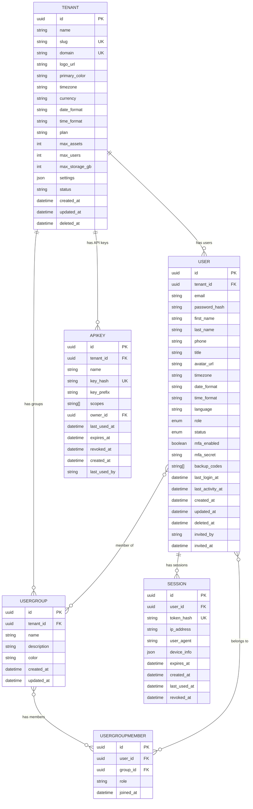

**Key Points:**
- All models scoped by `tenant_id` for multi-tenancy
- `User` has unique constraint on `[tenant_id, email]`
- `UserGroupMember` is the join table with composite unique on `[user_id, group_id]`
- RLS policies enforce tenant isolation at database level

---

## 2. Organization Hierarchy (Sites, Locations, Categories, Departments)

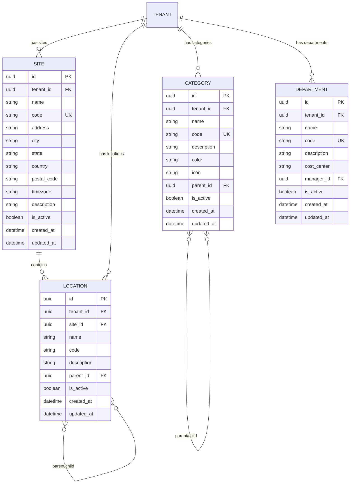

**Key Points:**
- Hierarchical locations (building → floor → room) via self-referencing `parent_id`
- Hierarchical categories via self-referencing `parent_id`
- Unique codes scoped to tenant (and site for locations)

---

## 3. Asset Core

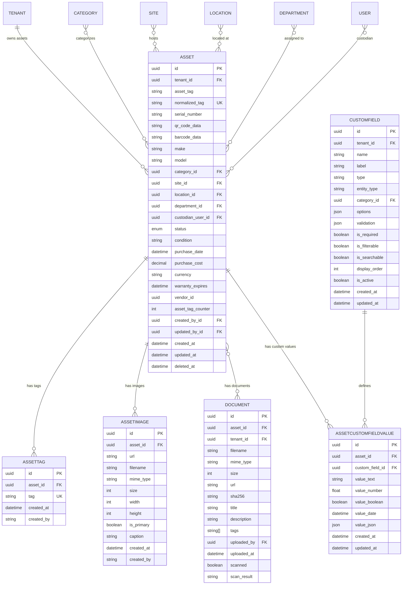

**Key Points:**
- `normalized_tag` ensures case-insensitive uniqueness per tenant
- Assets linked to Site → Location hierarchy (location is child of site)
- Custodian is a User (person responsible)
- Custom fields via EAV pattern (Entity-Attribute-Value) with `CustomField` definitions and `AssetCustomFieldValue` instances
- Documents are asset-optional (can exist without asset_id for global docs)

---

## 4. Asset Events / Lifecycle

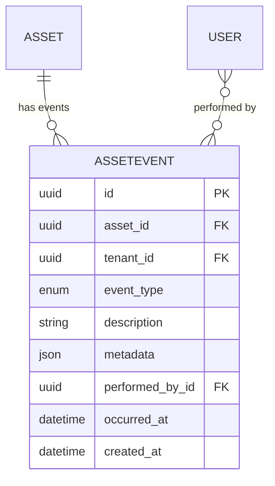

**Event Types:** `CHECK_OUT`, `CHECK_IN`, `MAINTENANCE_START`, `MAINTENANCE_COMPLETE`, `RESERVE`, `LEASE`, `LEASE_RETURN`, `MOVE`, `DISPOSE`, `RETIRE`, `TAG_CHANGE`, `CUSTODIAN_CHANGE`, `STATUS_CHANGE`

---

## 5. Maintenance

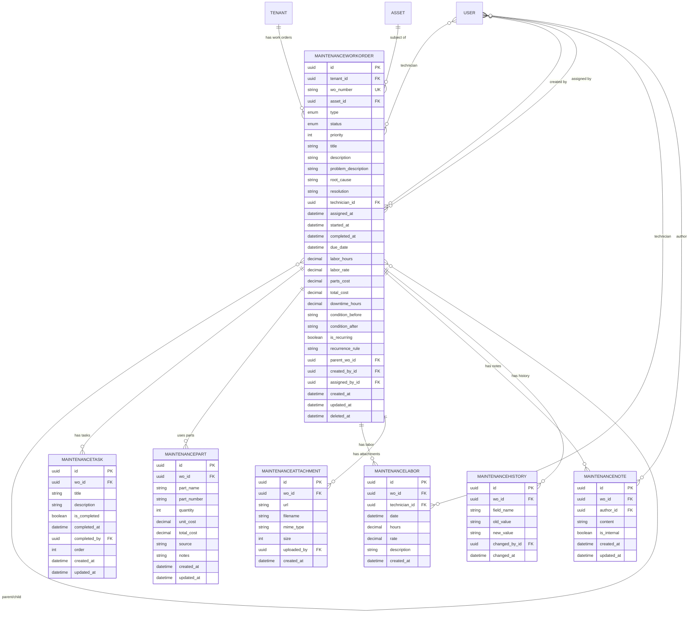

**Key Points:**
- Work orders can be recurring with `recurrence_rule` (cron-like)
- Parent/child work orders for complex jobs
- Full cost tracking: labor hours/rate, parts cost, total cost, downtime
- Immutable audit trail via `MaintenanceHistory`

---

## 6. Reservations

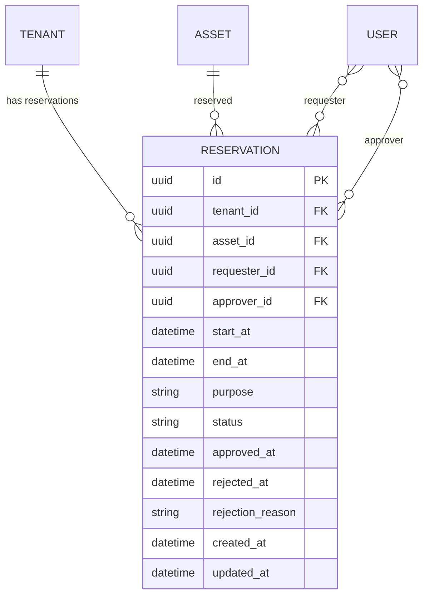

**Status Flow:** `PENDING` → `APPROVED`/`REJECTED` → `ACTIVE` → `COMPLETED`/`CANCELLED`

---

## 7. Audits (Physical Verification)

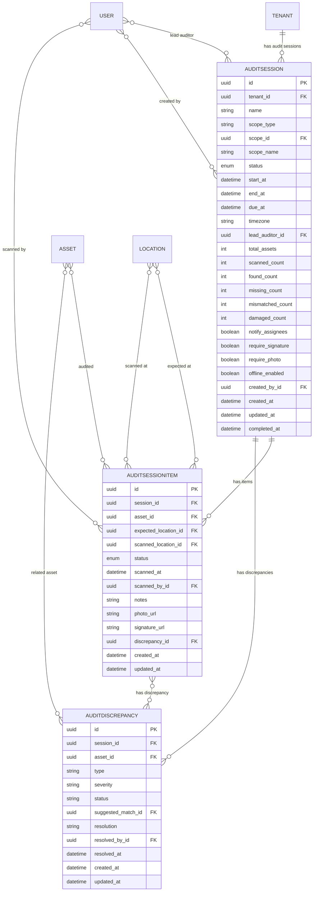

**Scope Types:** `SITE`, `BUILDING`, `FLOOR`, `ROOM`, `DEPARTMENT`, `ALL`
**Item Status:** `FOUND`, `MISSING`, `MISMATCHED`, `DAMAGED`
**Discrepancy Status:** `OPEN` → `RESOLVED`

**Key Points:**
- Audit sessions can be scoped to site, building, floor, room, department, or all assets
- Offline-enabled with PWA scanner support
- Discrepancies track mismatches between expected and scanned state
- Digital signatures and photos for compliance

---

## 8. Contracts & Warranties

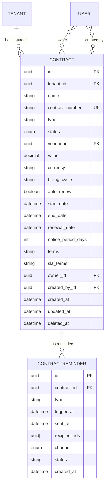

**Contract Status:** `ACTIVE`, `EXPIRED`, `PENDING_RENEWAL`, `TERMINATED`

---

## 9. Notifications & Webhooks

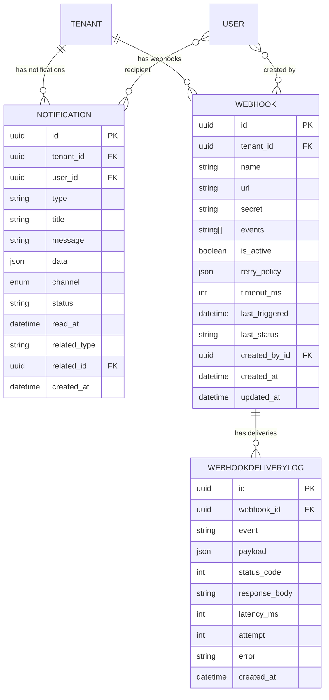

**Webhook Events:** `ASSET_CREATED`, `ASSET_UPDATED`, `ASSET_DELETED`, `ASSET_CHECKED_OUT`, `ASSET_CHECKED_IN`, `MAINTENANCE_STARTED`, `MAINTENANCE_COMPLETED`, `AUDIT_COMPLETED`, `WARRANTY_EXPIRING`, `AGENT_OFFLINE`

---

## 10. Agent Management (Endpoint Agent)

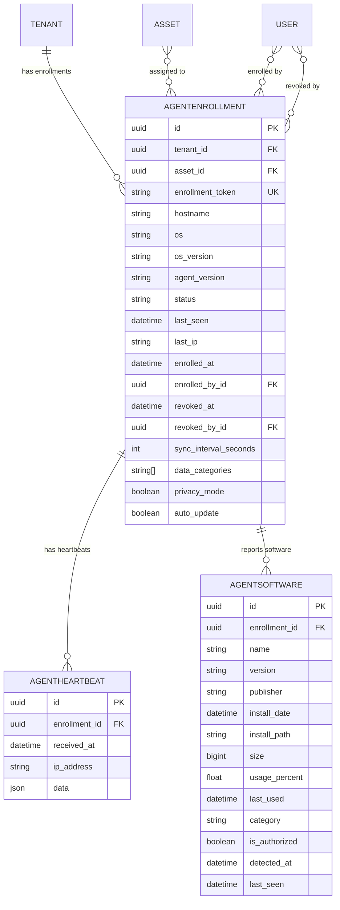

**Key Points:**
- Agent enrolls via token, optionally linked to an asset
- Heartbeats for online/offline detection
- Software inventory with authorization flags
- Privacy mode limits data collection
- Auto-update capability

---

## 11. Settings & Audit Log

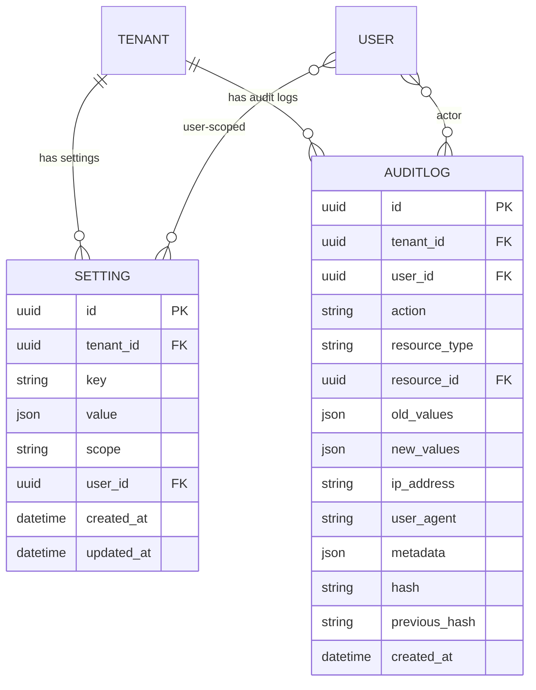

**Key Points:**
- Settings scoped to `tenant` or `user`
- AuditLog uses hash chaining (`previous_hash`) for tamper evidence
- Comprehensive indexing for query performance

---

## Cross-Model Relationships Summary

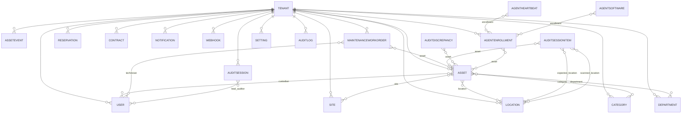

---

## Index Strategy

Every model includes `tenant_id` in composite indexes for RLS-friendly query patterns:

| Model | Key Indexes |
|---|---|
| `User` | `[tenant_id, status]`, `[tenant_id, role]`, `[tenant_id, email]` (unique) |
| `Asset` | `[tenant_id, status]`, `[tenant_id, site_id]`, `[tenant_id, location_id]`, `[tenant_id, category_id]`, `[tenant_id, custodian_user_id]`, `[tenant_id, serial_number]`, `[tenant_id, created_at]`, `[tenant_id, deleted_at]`, `[tenant_id, normalized_tag]` (unique) |
| `MaintenanceWorkOrder` | `[tenant_id, status]`, `[tenant_id, asset_id]`, `[tenant_id, technician_id]`, `[tenant_id, due_date]`, `[tenant_id, wo_number]` (unique) |
| `AuditSession` | `[tenant_id, status]`, `[tenant_id, due_at]`, `[tenant_id, lead_auditor_id]` |
| `Reservation` | `[tenant_id, asset_id, start_at]`, `[tenant_id, requester_id, status]`, `[tenant_id, status]` |
| `Contract` | `[tenant_id, status]`, `[tenant_id, vendor_id]`, `[tenant_id, end_date]`, `[tenant_id, renewal_date]`, `[tenant_id, contract_number]` (unique) |
| `AgentEnrollment` | `[tenant_id, status]`, `[tenant_id, asset_id]`, `[enrollment_token]` (unique) |
| `Notification` | `[tenant_id, user_id, status]`, `[tenant_id, created_at]`, `[related_type, related_id]` |
| `AuditLog` | `[tenant_id, created_at]`, `[tenant_id, user_id, created_at]`, `[tenant_id, resource_type, resource_id]`, `[action, created_at]` |

---

## RLS Policy Pattern

All multi-tenant tables have a `tenant_id` column and a PostgreSQL RLS policy:

```sql
-- Example pattern applied to all multi-tenant tables
ALTER TABLE "Asset" ENABLE ROW LEVEL SECURITY;

CREATE POLICY asset_tenant_isolation ON "Asset"
  FOR ALL TO app_user
  USING (tenant_id = current_setting('app.current_tenant_id')::uuid)
  WITH CHECK (tenant_id = current_setting('app.current_tenant_id')::uuid);
```

The Prisma middleware (`tenant-middleware.ts`) automatically sets `app.current_tenant_id` session variable before each query, ensuring transparent tenant isolation.

---

## Notes for Future Development

1. **No foreign keys in PostgreSQL** — relationships are enforced at application layer via Prisma; RLS provides tenant isolation
2. **Soft deletes** — `deleted_at` column on most models; queries filter `deleted_at IS NULL` by default
3. **UUID primary keys** — all IDs are UUID v4 generated by database
4. **Timestamps** — `created_at` (default now), `updated_at` (auto-update), `deleted_at` (soft delete)
5. **Decimal precision** — financial fields use `Decimal(12,2)` or `Decimal(10,2)`; labor hours use `Decimal(6,2)` or `Decimal(4,2)`
6. **Array columns** — PostgreSQL arrays used for tags, scopes, backup_codes, data_categories
7. **JSON/JSONB** — flexible metadata, settings, custom field values, webhook payloads
8. **Audit trail** — `AuditLog` captures all sensitive operations with hash chaining for integrity
9. **Agent offline-first** — `AgentEnrollment.offline_enabled`, `sync_interval_seconds` support disconnected operation